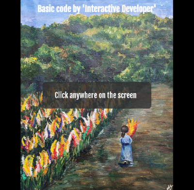
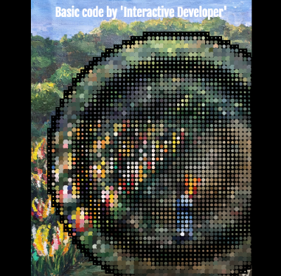
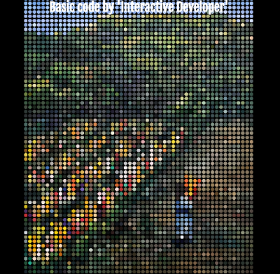

# Dotting

A project to show how many animation effects can be shown in HTML5. This project is packaged as a library with webpack to reuse more easier.

Click anywhere on the screen, then dotting is gonna be starting from this position.

The basic code is from the YouTuber `Interactive Developer`, and this video is under this link: https://youtu.be/kpF0n39xXVM

However, this project has been reconstructed in many parts for use later in the project `Rotary` and to make it as library with webpack.

## How to use

Write the url of the image in the constructor of `Dotting` and call animate on this instance recursively with `window.requestAnimationFrame()`.

```js
const url = './imgs/yeji.png';
const dotting = new Dotting(url);
dotting.resize();
window.requestAnimationFrame(animate);

function animate(curTime) {
  dotting.animate(curTime);
  window.requestAnimationFrame(animate);
}
```

## Used tools

- HTML5
- CSS3
- JavaScript

## Overview

  
  
  

## Page

https://tokenkim92.github.io/Dotting/
